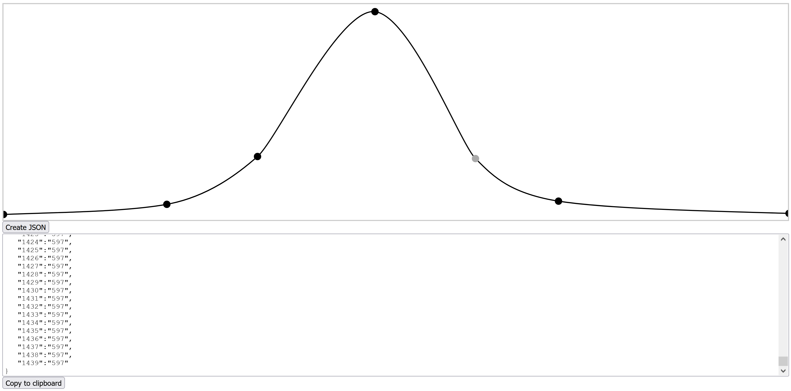

# curveasjson

This is a total hack but it works for my use case. I was looking for a fast way to synthesize a PV generation profile but only found rather complex tools on the web and  nothing that spits out data minute-wise. I made this little tool, it's just a single HTML file, where you modify a spline (in my case, to the shape of the generation curve) and, via a press on the `Create JSON` button, then generate minute-wise JSON data. 

The drawing area is 1440 pixels wide, representing the 24 * 60 = 1440 minutes of a day. The y-axis values range from 0 (at the very bottom) to 1000 (at the very top). 

Points can be added via a single left-click into the drawing area and deleted via selecting a point and pressing or `Del`.

# Todo:
- [x] Make first and last point stick to edges
- [x] Click between points to add a point
- [x] Don't allow for points to cross another point (on the x-axis)
- [ ] Add options for x and y output scaling, output step-width, output offsets
